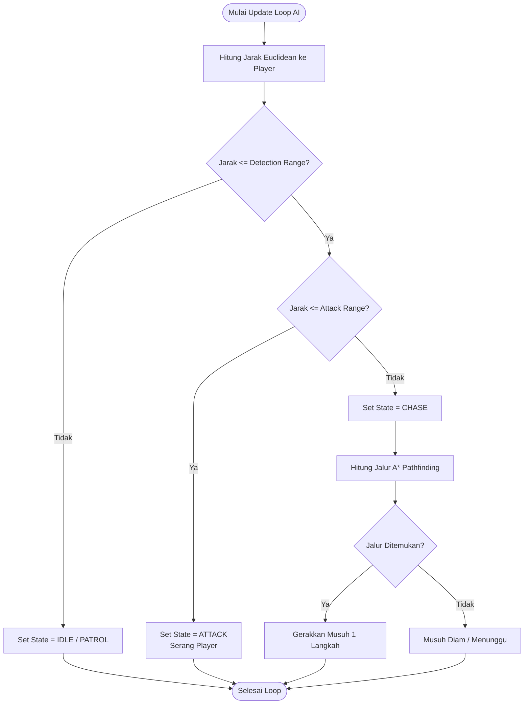

Nama: Galea Violet
NIM: 20240801104
Kelas: KH001
Mata Kuliah: Game Development

# Tugas Game Development: Enemy AI Detection, Pathfinding, and Movement in Dungeon

Tugas ini berisi penjelaskan logika dan implementasi sistem kecerdasan buatan (Enemy AI) pada game *Dungeon Crawler*, yang mencakup mekanisme deteksi pemain, penentuan jangkauan serangan, pencarian rute terpendek, dan pergerakan musuh.

---

## 1. Identifikasi Algoritma yang Digunakan

Untuk menangani skenario pergerakan dan deteksi musuh di dalam dungeon, digunakan kombinasi 3 algoritma utama:

### A. Finite State Machine (FSM)
FSM digunakan sebagai pengambil keputusan (*decision maker*) untuk mengatur status perilaku musuh secara dinamis:
- **IDLE / PATROL**: Musuh diam atau berpatroli saat player berada di luar jangkauan deteksi.
- **CHASE**: Musuh mulai mengejar player (mengaktifkan algoritma pencarian jalur) ketika player memasuki jangkauan deteksi (*Detection Range*).
- **ATTACK**: Musuh berhenti dan menyerang ketika player berada pada jangkauan serang (*Attack Range*).

### B. Euclidean Distance (Deteksi & Jangkauan)
Digunakan untuk menghitung jarak fisik langsung antara lokasi musuh (x1, y1) dan lokasi player (x2, y2):

`Jarak (d) = sqrt((x2 - x1)^2 + (y2 - y1)^2)`

- Jika `d <= Jangkauan Deteksi`, musuh berganti state ke **CHASE**.
- Jika `d <= Jangkauan Serang`, musuh berganti state ke **ATTACK**.

### C. A* (A-Star) Pathfinding Algorithm
Algoritma pencarian jalur terpendek dari posisi musuh menuju posisi player di dalam grid dungeon yang memiliki rintangan (dinding/obstacle).

A* menentukan rute terbaik dengan menghitung fungsi biaya `f(n) = g(n) + h(n)`:
- `g(n)`: Biaya langkah dari posisi awal ke node saat ini.
- `h(n)`: Estimasi jarak heuristik (Manhattan Distance) dari node saat ini ke posisi player:  
  `h(n) = |x_player - x_node| + |y_player - y_node|`
- `f(n)`: Total estimasi biaya jalur.

---

## 2. Flowchart Algoritma Enemy AI

Berikut adalah alur kerja sistem AI musuh:



### Versi Alur Teks

```text
[MULAI LOOP UPDATE AI ENEMY]
         │
         ▼
[Hitung Jarak Euclidean ke Player]
         │
         ▼
<Apakah Jarak <= Jangkauan Deteksi?> ────── Tidak ─────► [Set State = IDLE] ──► [SELESAI]
         │
        Ya
         │
         ▼
<Apakah Jarak <= Jangkauan Serang?> ─────── Ya ───────► [Set State = ATTACK] ─► [SELESAI]
         │
       Tidak
         │
         ▼
[Set State = CHASE]
         │
         ▼
[Hitung Rute Terpendek Menggunakan A* Pathfinding]
         │
         ▼
<Apakah Jalur Ditemukan?> ────── Tidak ─────► [Musuh Diam / Standby] ──► [SELESAI]
         │
        Ya
         │
         ▼
[Update Posisi Musuh 1 Langkah ke Node Berikutnya]
         │
         ▼
     [SELESAI]
```

---

## 3. Code Snippet & Simulasi

Implementasi kode dibagi menjadi dua versi:

1. **Simulasi Python (`main.py`)**: Program CLI interaktif untuk menguji pergerakan musuh `E` mengejar player `P` pada peta grid dungeon secara langsung.
2. **Skrip C# (`EnemyAI.cs`)**: Implementasi class berstandar Game Engine (Unity).

### Contoh Implementasi Singkat Logika AI (Python)

```python
import math

class EnemyAI:
    def __init__(self, x, y, detection_range=10.0, attack_range=1.5):
        self.x = x
        self.y = y
        self.detection_range = detection_range
        self.attack_range = attack_range
        self.state = "IDLE"

    def update(self, player_x, player_y, grid):
        # 1. Hitung Jarak Euclidean ke Player
        distance = math.sqrt((self.x - player_x)**2 + (self.y - player_y)**2)

        # 2. Evaluasi FSM (Detection & Attack Range)
        if distance > self.detection_range:
            self.state = "IDLE"
        elif distance <= self.attack_range:
            self.state = "ATTACK"
        else:
            self.state = "CHASE"
            # 3. Cari rute A* dan gerakkan musuh 1 langkah
            path = astar_pathfinding(grid, (self.x, self.y), (player_x, player_y))
            if len(path) > 1:
                self.x, self.y = path[1]
```

### Cara Menjalankan Simulasi
```bash
python main.py
```
