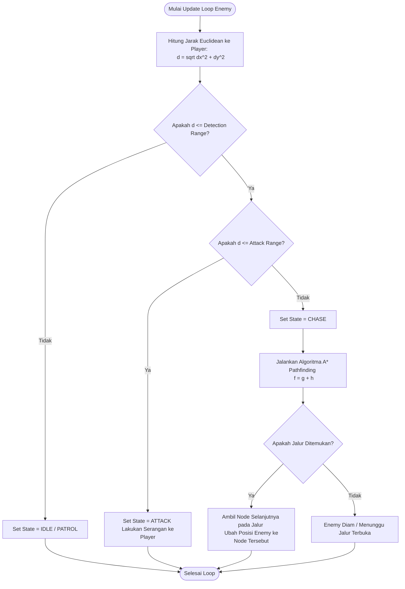

# Tugas Game Development: Enemy AI Detection, Pathfinding, and Movement in Dungeon

Dokumen ini berisi identifikasi algoritma, *flowchart*, serta *code snippet* (Python & C#) untuk sistem pergerakan dan AI Musuh (*Enemy AI*) di dalam game *Dungeon Crawler*.

---

## 1. Identifikasi Algoritma yang Digunakan

Dalam skenario di mana musuh (*Enemy*) mendeteksi *Player*, menentukan jangkauan, mencari jalur di dalam dungeon, dan bergerak mendekati *Player*, digunakan kombinasi 3 algoritma utama:

### A. Finite State Machine (FSM) – Pengambil Keputusan (Decision Making)
Algoritma ini mengatur status/perilaku musuh berdasarkan situasi di sekitar *Player*:
- **IDLE / PATROL**: Musuh diam atau berpatroli saat *Player* belum terdeteksi.
- **CHASE**: Musuh mengejar *Player* (mengaktifkan algoritma pencarian jalur) saat *Player* masuk dalam **Jangkauan Deteksi** (*Detection Range*).
- **ATTACK**: Musuh berhenti bergerak dan melakukan serangan saat *Player* berada dalam **Jangkauan Serang** (*Attack Range*).

### B. Euclidean Distance & Line of Sight – Deteksi & Penentuan Jangkauan
Untuk mengukur apakah *Player* berada dalam jangkauan deteksi atau serangan, digunakan perhitungan **Jarak Euclidean**:

$$d = \sqrt{(x_2 - x_1)^2 + (y_2 - y_1)^2}$$

Di mana:
- $(x_1, y_1)$ adalah koordinat Enemy.
- $(x_2, y_2)$ adalah koordinat Player.
- Jika $d \le \text{Detection Range}$, musuh akan mulai mengejar (*Chase*).
- Jika $d \le \text{Attack Range}$, musuh akan mulai menyerang (*Attack*).

### C. A* (A-Star) Pathfinding Algorithm – Pencari Jalur Terpendek
Algoritma utama yang digunakan untuk mencari jalur terbaik di dalam *dungeon grid* yang penuh rintangan (dinding/obstacle).

A* memilih jalur terbaik dengan mengevaluasi fungsi biaya (*cost function*):

$$f(n) = g(n) + h(n)$$

- **$g(n)$**: Jarak nyata yang ditempuh dari node awal (*Enemy*) ke node saat ini $n$.
- **$h(n)$**: Estimasi jarak heuristik dari node $n$ ke target (*Player*). Digunakan **Manhattan Distance**:
  $$h(n) = |x_{\text{target}} - x_n| + |y_{\text{target}} - y_n|$$
- **$f(n)$**: Total perkiraan biaya jalur melalui node $n$.

**Mengapa A*?**
A* jauh lebih efisien dibandingkan Breadth-First Search (BFS) atau Dijkstra karena menggunakan nilai heuristik $h(n)$ untuk mengarahkan pencarian langsung ke posisi *Player* tanpa membuang waktu mengeksplorasi area dungeon yang salah.

---

## 2. Flowchart Algoritma Enemy AI

Berikut adalah diagram alir (*flowchart*) logika kerja AI Enemy dari deteksi hingga pergerakan:



### Versi Teks Flowchart (Diagram Alir)
```
[MULAI LOOP UPDATE AI ENEMY]
         │
         ▼
[Hitung Jarak Euclidean ke Player]
         │
         ▼
<Apakah Jarak <= Jangkauan Deteksi?> ────── Tidak ─────► [Set State = IDLE] ──► [SELESAI]
         │
        Ya
         │
         ▼
<Apakah Jarak <= Jangkauan Serang?> ─────── Ya ───────► [Set State = ATTACK] ─► [SELESAI]
         │
       Tidak
         │
         ▼
[Set State = CHASE]
         │
         ▼
[Jalankan Algoritma A* Pathfinding (Hitung Cost f = g + h)]
         │
         ▼
<Apakah Jalur ke Player Ditemukan?> ────── Tidak ─────► [Enemy Diam/Stuck] ──► [SELESAI]
         │
        Ya
         │
         ▼
[Gerakkan Enemy 1 Langkah ke Node Berikutnya]
         │
         ▼
     [SELESAI]
```

---

## 3. Code Snippet

Proyek ini menyediakan dua sampel implementasi kode yang siap digunakan:

1. [`main.py`](file:///d:/Documents/Semester%205/Game%20Development/Dungeon%20Game/main.py): Simulasi CLI interaktif lengkap menggunakan Python (menampilkan peta dungeon grid ASCII, jalur A*, dan pergerakan musuh langkah demi langkah).
2. [`EnemyAI.cs`](file:///d:/Documents/Semester%205/Game%20Development/Dungeon%20Game/EnemyAI.cs): Implementasi class C# berstandar Game Engine (Unity / Standalone).

### Kode Python (`main.py`)
```python
import math
import heapq

class Node:
    def __init__(self, x: int, y: int, walkable: bool = True):
        self.x = x
        self.y = y
        self.walkable = walkable
        self.g = float('inf')
        self.h = 0.0
        self.f = float('inf')
        self.parent = None

    def __lt__(self, other):
        return self.f < other.f

# Algoritma A* Pathfinding
def astar_pathfinding(grid, start_pos, target_pos):
    # Reset Node costs
    for row in grid.nodes:
        for node in row:
            node.g, node.f, node.parent = float('inf'), float('inf'), None

    start_node = grid.get_node(*start_pos)
    target_node = grid.get_node(*target_pos)
    
    start_node.g = 0
    start_node.h = abs(start_node.x - target_node.x) + abs(start_node.y - target_node.y)
    start_node.f = start_node.g + start_node.h

    open_set = [(start_node.f, start_node)]
    closed_set = set()

    while open_set:
        _, current = heapq.heappop(open_set)

        if current == target_node:
            path = []
            curr = current
            while curr:
                path.append((curr.x, curr.y))
                curr = curr.parent
            return path[::-1]

        closed_set.add(current)

        for neighbor in grid.get_neighbors(current):
            if neighbor in closed_set or not neighbor.walkable:
                continue

            tentative_g = current.g + 1
            if tentative_g < neighbor.g:
                neighbor.parent = current
                neighbor.g = tentative_g
                neighbor.h = abs(neighbor.x - target_node.x) + abs(neighbor.y - target_node.y)
                neighbor.f = neighbor.g + neighbor.h
                heapq.heappush(open_set, (neighbor.f, neighbor))

    return []

# Kelas Enemy AI (Finite State Machine + Detection + Movement)
class EnemyAI:
    def __init__(self, x, y, detection_range=10.0, attack_range=1.5):
        self.x = x
        self.y = y
        self.detection_range = detection_range
        self.attack_range = attack_range
        self.state = "IDLE"

    def update(self, player_x, player_y, grid):
        # 1. Hitung Jarak Euclidean
        distance = math.sqrt((self.x - player_x)**2 + (self.y - player_y)**2)

        # 2. Penentuan State (Deteksi & Jangkauan)
        if distance > self.detection_range:
            self.state = "IDLE"
        elif distance <= self.attack_range:
            self.state = "ATTACK"
        else:
            self.state = "CHASE"
            # 3. Pathfinding A* & Movement
            path = astar_pathfinding(grid, (self.x, self.y), (player_x, player_y))
            if len(path) > 1:
                self.x, self.y = path[1]  # Bergerak 1 node ke depan
```

---

## 4. Cara Menjalankan Simulasi Kode

Untuk melihat simulasi algoritma secara langsung di komputer Anda:

```bash
# Jalankan script python
python main.py
```

Anda akan melihat output visual peta dungeon di terminal, posisi Player `P`, Enemy `E`, rintangan `###`, dan jejak lintasan A* `*`.

---

## 5. Cara Commit dan Upload Jawaban ke GitHub

Ikuti langkah-langkah di bawah ini untuk mengupload seluruh file tugas ini ke akun GitHub Anda:

### Langkah 1: Buat Repository Baru di GitHub
1. Buka [GitHub.com](https://github.com) dan login ke akun Anda.
2. Klik tombol **+** di pojok kanan atas, lalu pilih **New repository**.
3. Beri nama repository, misalnya: `Dungeon-Game-Enemy-AI`.
4. Pilih **Public**, lalu klik **Create repository**.
5. Salin URL repository Anda (contoh: `https://github.com/USERNAME/Dungeon-Game-Enemy-AI.git`).

### Langkah 2: Commit dan Push Kode dari Terminal
Buka terminal/PowerShell di folder proyek ini (`d:\Documents\Semester 5\Game Development\Dungeon Game`), lalu jalankan perintah berikut:

```bash
# 1. Inisialisasi Git Repository
git init

# 2. Tambahkan semua file ke staging area
git add .

# 3. Buat Commit pertama
git commit -m "Add Enemy AI Algorithm Identification, Flowchart, and Code Implementation"

# 4. Ubah nama branch utama menjadi main
git branch -M main

# 5. Hubungkan ke repository GitHub Anda (ganti URL dengan URL repository Anda)
git remote add origin https://github.com/USERNAME/Dungeon-Game-Enemy-AI.git

# 6. Push kode ke GitHub
git push -u origin main
```

Setelah selesai, berikan link repository GitHub Anda kepada dosen/pengumpul tugas!
